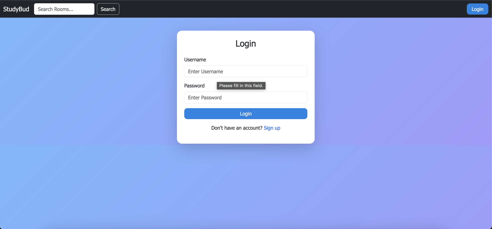
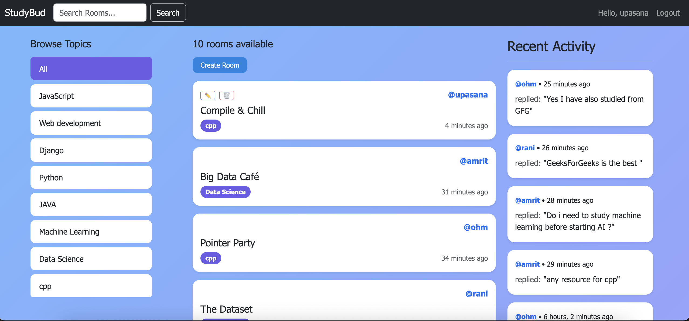
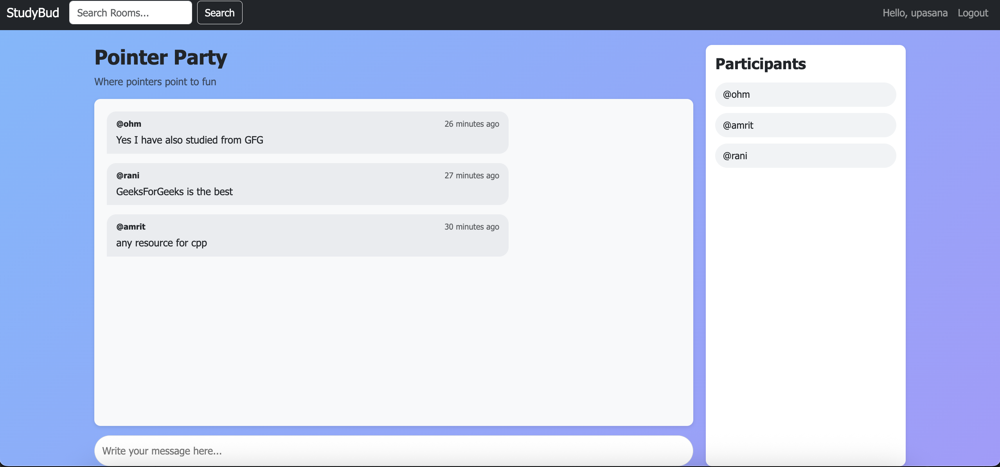
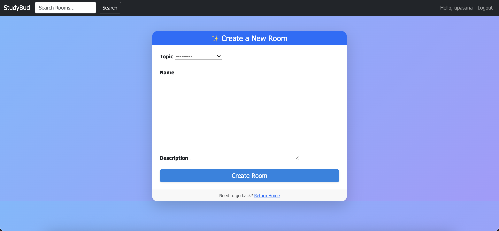
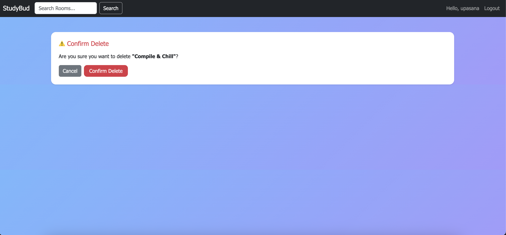
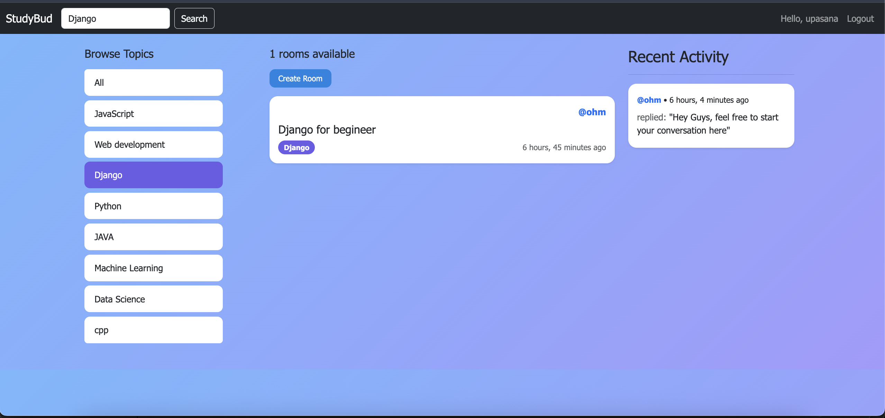

# StudyBud

A simple Django web app for creating and joining study rooms. Users can discuss topics, share ideas, and collaborate in real-time.

## Features
- User authentication (login/register/logout)
- Create, update, and delete study rooms
- Join rooms and participate in discussions
- Browse topics and explore user profiles
- Search rooms by topic or name

## Tech Stack
- Django
- SQLite (default database)
- HTML, CSS, Django Templates

## Setup
1. Clone this repository:
   ```bash
   (https://github.com/ohm2905/StudyBud-Final)


Create and activate a virtual environment:

python -m venv env
source env/bin/activate  # On Windows: env\Scripts\activate


Install dependencies:

pip install -r requirements.txt


Run migrations:

python manage.py migrate


Start the server:

python manage.py runserver


Open in your browser:
http://127.0.0.1:8000

## Screenshots


### Login Page



### Home Page


### Message Page


### Room Page



### Delete Page



### Specific-filter Page



Made with ❤️ using Django
